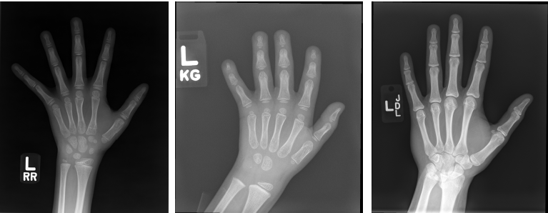

# Bone Age Prediction from Hand Radiographs
This is a project carried out for Deep Learning and Human Data Analytics Course in University of Padua.

## Table of contents
* [General Info](#General-Info)
* [Dataset Description](#Dataset-Description)
* [Project Structure](#Project-Structure)

## General Info
This study investigates the use of convolutional neural networks (CNNs) for estimating the age of children based on hand bone radiographs. Five different base models were tested, including basic CNNs, inception blocks, residual skip connections, pre-activation skip connections, and inception blocks with skip connections. The models were trained with various hyperparameter choices, such as batch normalization, gender information, drop-out regularization, and data augmentation. The combination of inception blocks and batch normalization with gender information showed the best results in terms of accuracy.

### Task
Solve the bone age prediction as a regression task.
- As input: use row images or extract futures
- As output: use the age value for regression
- Assess the importance of the gender information

## Dataset Description
- Hands’ X-ray images (digital and scanned) from two U.S. hospitals
- 12611 of images in training set, 1425 of images in validation set, 200 of images in test set
- CSV file containing the age (to be predicted) and the gender (useful additional information)




- Download images from : https://stanfordmedicine.app.box.com/s/4r1zwio6z6lrzk7zw3fro7ql5mnoupcv/folder/42459416739
- Dataset owner: Stanford Medicine
- Create folder "Bone Age Datasets"
- Put images in train, validation, test folders
- Add csv files in this repo inside the same folder

- The final structure is given below:
```bash
├── Bone Age Datasets
│   ├── train
│   ├── validation
│   ├── test
│   ├── train.csv
│   ├── validation.csv
│   └── test.csv
```

## Project Structure
```bash
├── Task_description.pdf 
├── Report.pdf
├── Presentation.pptx
├── Experiments_results.ods
├── main.py
├── model_trials.py
├── inception.py
├── resnet.py
├── utils.py
├── Additional Resources
│   ├── Halabi.pdf
│   └── Larson.pdf
└── README.md
```
